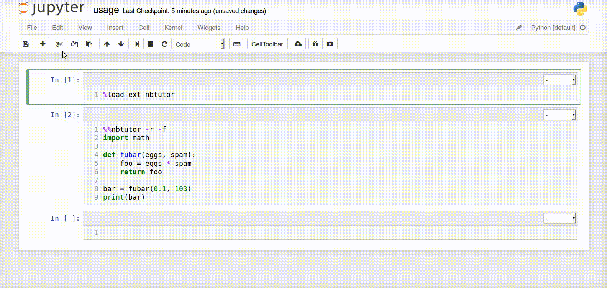

# Nbtutor
Visualize Python code execution (line-by-line) in [Jupyter
Notebook](http://jupyter.org) cells. Inspired by [Online Python
Tutor](http://pythontutor.com).

**Note: This project is not quite ready for release. This has only been tested
using Python3.5 and will probably fall over in Python2.7**




## Usage (Jupyter Notebook)
First load the `nbtutor` IPython kernel extension at top of the Notebook by
executing the following magic in a `CodeCell`:
```python
%load_ext nbtutor
```

Then to visualize the execute of code in a `CodeCell` add the following
magic to the top of the `CodeCell` and execute it again:
```python
%%nbtutor
```

### Optional arguments
There are also optional arguments that can be used with the cell magic:

- Reset the IPython user namespace
```python
%%nbtutor -r/--reset
```

- Suppress the confirmation message from `-r/--reset`
```python
%%nbtutor -r/--reset -f/--force
```

- Render primitive objects inline
```python
%%nbtutor -i/--inline
```

- Specify the maximum frame depth to visualize
```python
%%nbtutor -d/--depth N
```

- Specify the number of significant digits for floats
```python
%%nbtutor --digits D
```

*Note: The "Global" frame is depth 0; the default depth is 1, and the default
significant digits is 3*


## Develop
This assumes you have cloned this repository locally:
```shell
git clone https://github.com/lgpage/nbtutor.git
cd nbtutor
```

### Repo architecture
The `nbtutor` nbextension is built from `./src` into
`./nbtutor/static/nbtutor` with:
- `less` for style
- `es6` (via `babel`) for javascript
- `browserify` for packaging

The `nbtutor` ipython kernel extension (magics) is stored in the
`./nbtutor/ipython` folder

Build tools are stored in the `./tools` folder.

### Getting started
You'll need conda installed, either from
[Anaconda](https://www.continuum.io/downloads) or
[miniconda](http://conda.pydata.org/miniconda.html).
You can create a Python development environment named `nbtutor` from
`./environment.yml`.

```shell
conda create -n nbtutor python=YOUR_FAVORITE_PYTHON
conda env update
source activate nbtutor
```

We use `npm` for `node.js` dependencies, so then run:
```shell
npm install
```

Finally, you are ready to build the assets with:
```shell
npm run build
```

### Installing the nbextension
To ensure that you always get the right assets (for development), install
the nbextension with the `symlink` options:
```shell
python setup.py develop
jupyter nbextension install --overwrite --symlink --sys-prefix --py nbtutor
jupyter nbextension enable --sys-prefix --py nbtutor
```
