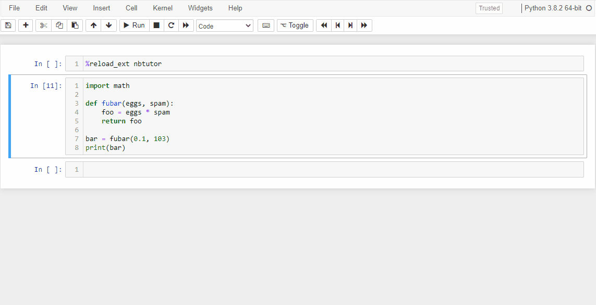

# Nbtutor

Visualize Python code execution (line-by-line) in [Jupyter Notebook] cells. Inspired by [Online Python Tutor]



[](https://mybinder.org/v2/gh/lgpage/nbtutor/HEAD)

## Install

Note: installing directly off this repo won't work, as we don't ship the built JavaScript and CSS assets.
See more about [developing](#developing) below.

### `pip`

```shell
pip install nbtutor
jupyter nbextension install --overwrite --py nbtutor
jupyter nbextension enable --py nbtutor
```

### `conda`

```shell
conda install -c conda-forge nbtutor
jupyter nbextension install --overwrite --py nbtutor
jupyter nbextension enable --py nbtutor
```

## Usage (Jupyter Notebook)

First load the `nbtutor` IPython kernel extension at top of the Notebook by executing the following magic in a
`CodeCell`:

```python
%load_ext nbtutor
```

Then to visualize the execute of code in a `CodeCell` add the following magic to the top of the `CodeCell`
and execute it again:

```python
%%nbtutor
```

### Optional Arguments

There are also optional arguments that can be used with the cell magic:

- Reset the IPython user namespace

  ```python
  %%nbtutor -r/--reset
  ```

- Suppress the confirmation message from `-r/--reset`

  ```python
  %%nbtutor -r/--reset -f/--force
  ```

- Specify the maximum frame depth to visualize (default: 3)

  ```python
  %%nbtutor -d/--depth N
  ```

- Specify the maximum number of elements to visualize for "sequence"
   type objects (default: 5)

  ```python
  %%nbtutor --max_size S
  ```

- Step through all frames (including frames from other cells and other
   global scopes altogether)

  ```python
  %%nbtutor --step_all
  ```

### Notes

- If you find a problem please feel free to submit a [GitHub Issue]

## Develop

Please see the [DEVELOPMENT.md](DEVELOPMENT.md) file

[Jupyter Notebook]: https://jupyter.org
[Online Python Tutor]: http://pythontutor.com/index.html
[GitHub Issue]: https://github.com/lgpage/nbtutor/issues
